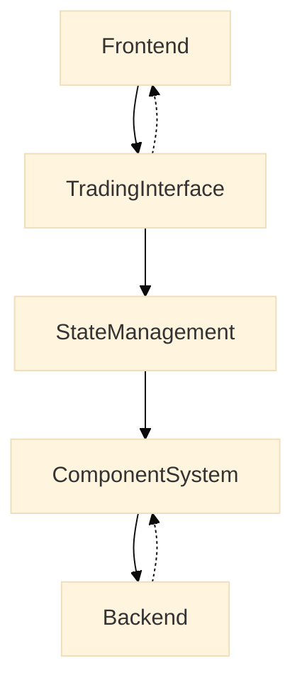

# Blockfolio (Temporary) 

Just a chill crypto dashboard turned professional-ish trading platform.  
Built with React, because why not. Real-time data, smooth UI, and some lazy dev magic.

---

## Overview

We took a basic crypto dashboard and gave it a glow-up.  

**Goal:** Make trading less painful and more visual — fast charts, smooth updates, easy portfolio vibes.

**Focus:**  
- Portfolio-first layout (because money matters)  
- Sexy charts, not boring numbers  
- Real-time updates, like “oh that just changed”  
- Quick trading flow, less clicking, more sipping coffee ☕

More detailed requirements & design: [Click here](https://file.kiwi/cbc2e8b0#SpqfZ20pidgKHlBakNFzCw)

---

## System Flow



- The flow is simple: Portfolio → Scan → Analyze → Trade → Repeat.

---

## Architecture


- The architecture separates frontend, trading interface, state management, components, and backend for clarity and speed.
- 
---

## Layout & Components

- Desktop has portfolio left, market center, trading panel right. Tablet stacks portfolio, market/trading, and charts. Mobile uses vertical stack with tabs and swipeable cards. Components include a navigation bar, dashboard layout, modals for details, portfolio charts, market stats, trading panels, order books, and history.

---

## Data & Error Handling

- Portfolio shows value, holdings, allocation, and sparklines. Trading handles coin selection, amounts, totals, fees, buy/sell, and confirmations. Charts show OHLC, candlesticks, volume, and indicators. Market data shows coins, stats, top movers, and last updates. The system retries failed requests, caches offline, shows connection status, verifies balances, checks market closures, validates input, provides chart fallbacks, and parses backend errors safely.

---

## Testing & Quick Start

- Unit tests cover UI, API, and errors. Property-based tests ensure allocations sum to 100%. Integration tests cover API feeds, charts, and trading workflow.

```bash
npm install && cd client && npm install
npm run dev
```

```
npm install && cd client && npm install
npm run dev
```

---

## Tech & API

- React 18 + Tailwind CSS, Chart.js, Canvas API, Node.js/Express, SQLite.
Endpoints: /api/coins/prices (prices), /api/wallet (wallet), /api/transactions/buy & /sell (trades).

---

## File Structure

client/src/
├── components/       # UI components
├── services/         # data management
├── hooks/            # React hooks
├── styles/           # CSS
└── pages/            # Pages

---

## Notes

- Just a solo project, built lazily and incrementally. Made by a coder who overthinks everything I see. Mermaid diagrams rendering on GitHub is pretty cool, btw.

P.S. I’ll often update this in the future and proceed with tasks one by one.
